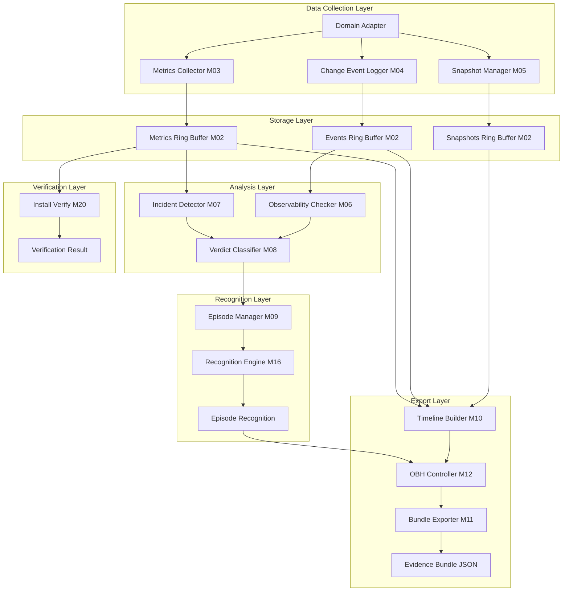
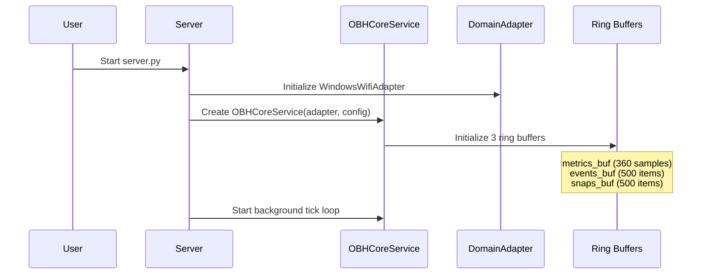
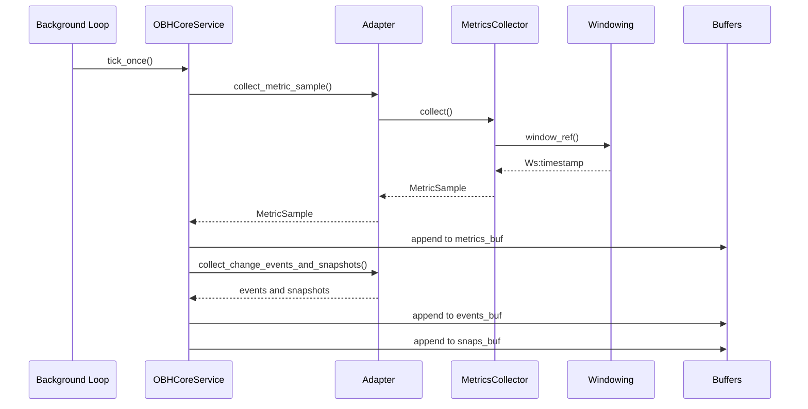
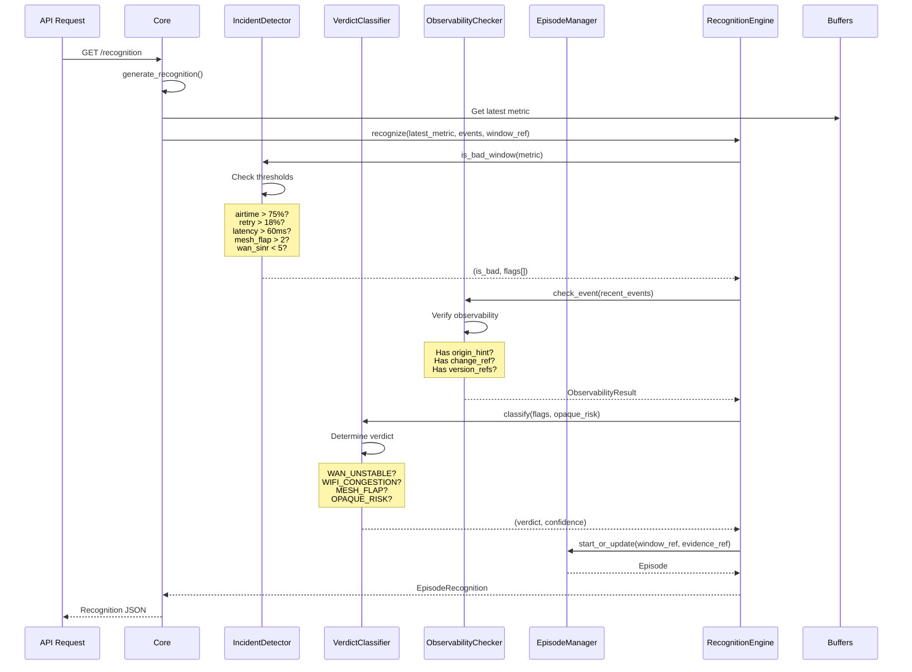
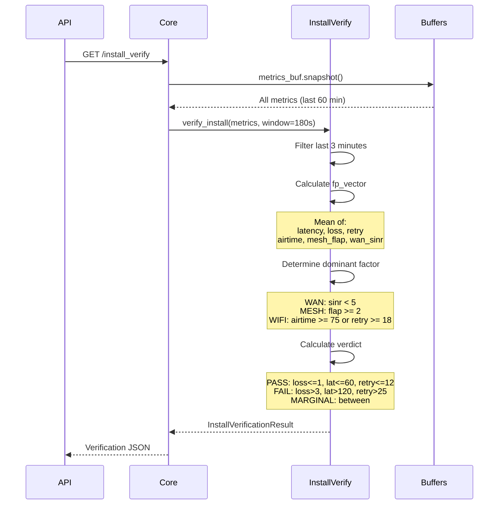
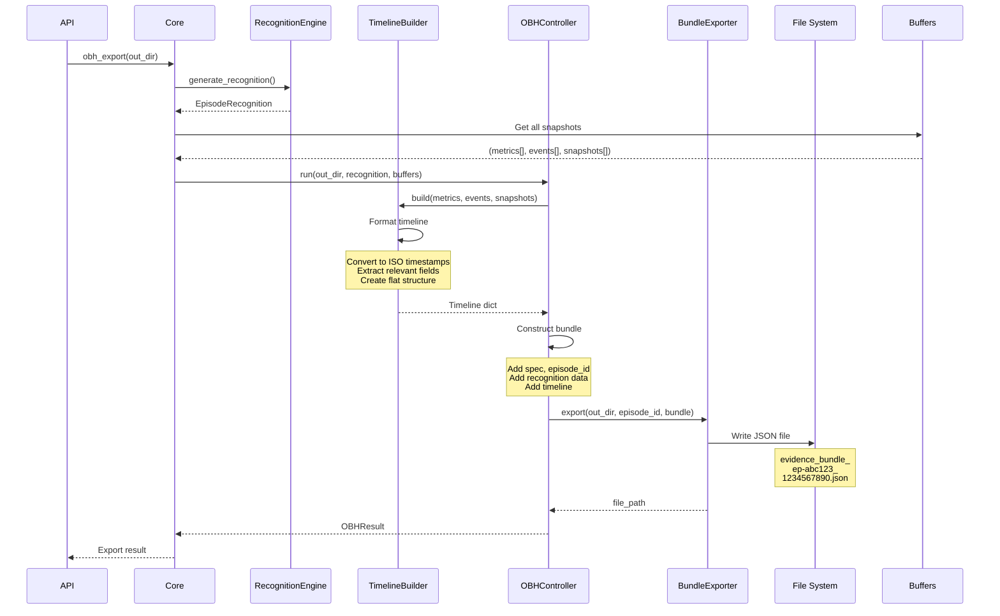
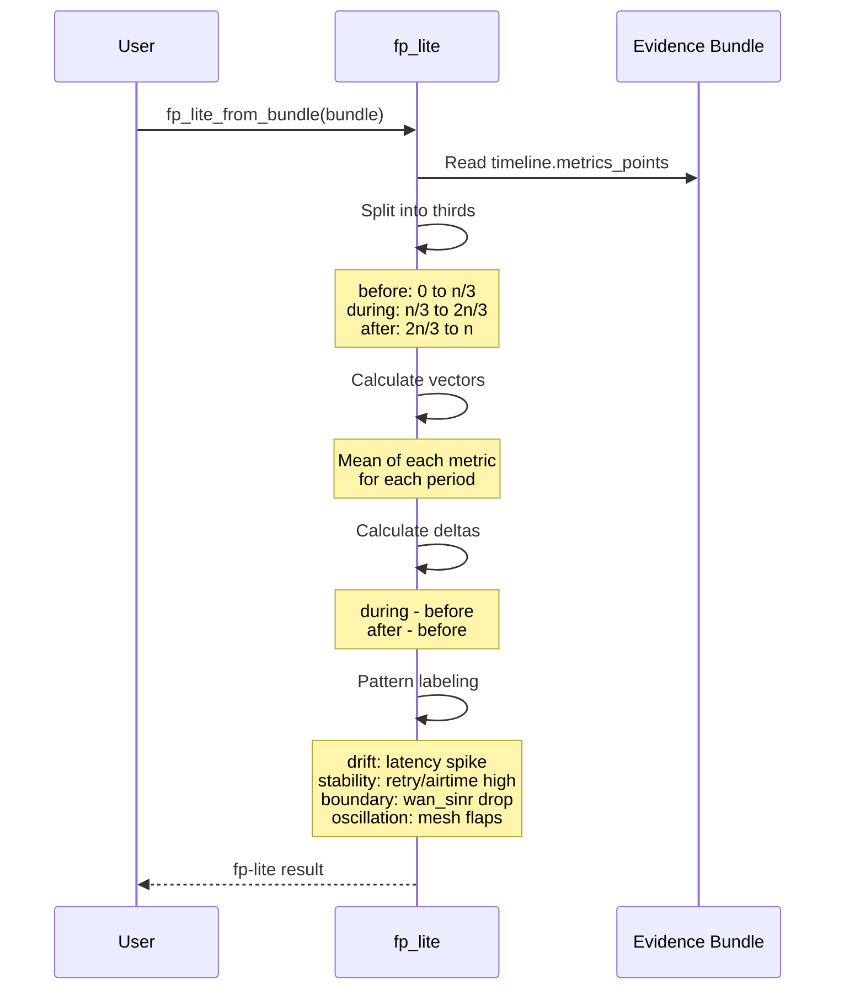
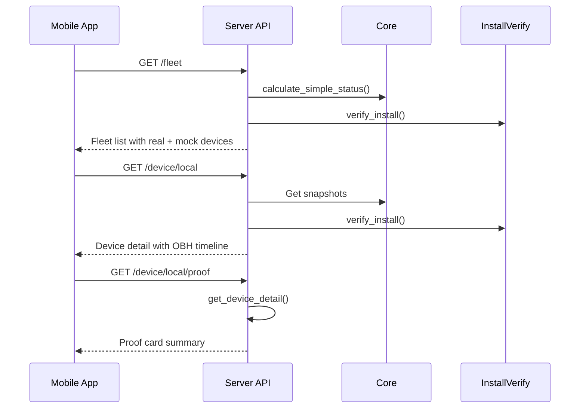
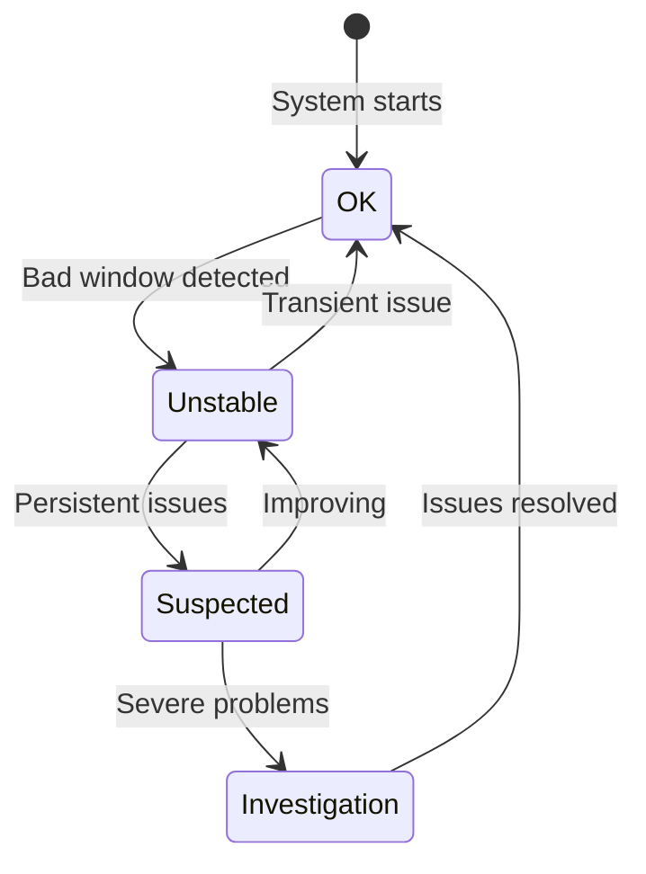
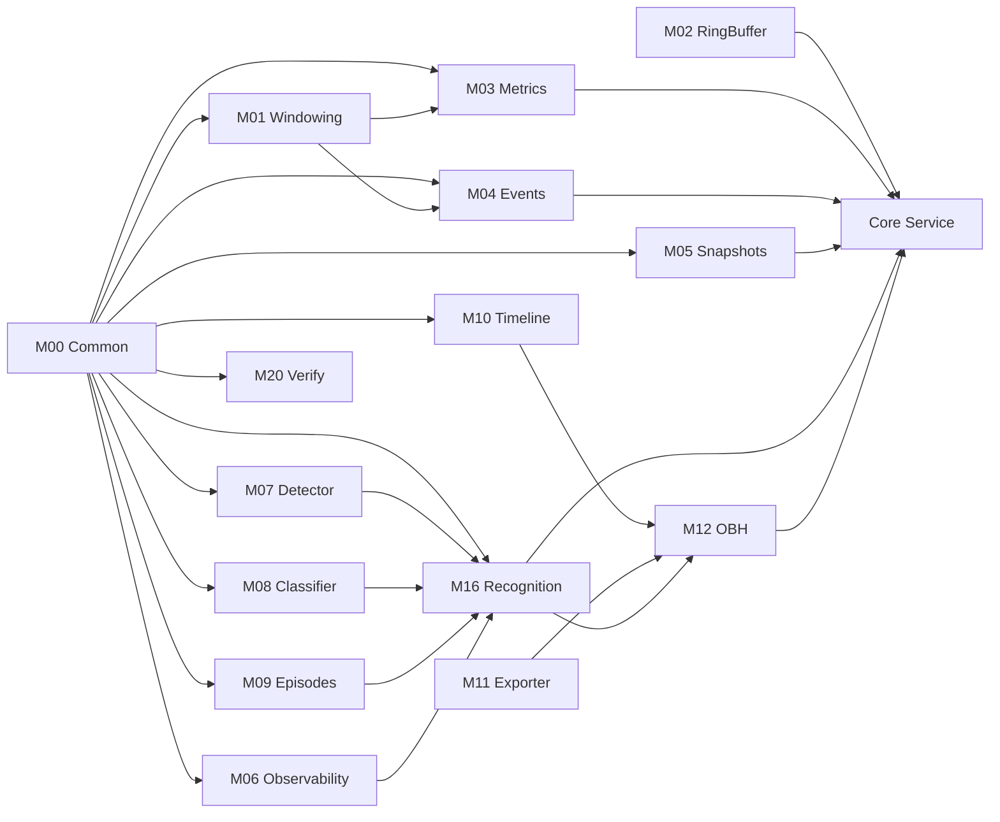

# DAE P1 System Workflow

## System Architecture Overview



---

## Complete System Workflow

### Phase 1: Initialization



**Key Components Initialized**:
1. **WindowsWifiAdapter** - Collects real WiFi data from Windows
2. **OBHCoreService** - Core orchestrator
3. **Ring Buffers** - 60-minute rolling storage
4. **Windowing** (M01) - Time window reference generator
5. **Recognition Engine** (M16) - Incident analyzer

---

### Phase 2: Continuous Data Collection (Every 1-10 seconds)



**This cycle repeats every 1-10 seconds based on `sample_interval_sec` configuration.**

**Data Collected Each Cycle**:
- **MetricSample**: 17 network metrics (latency, loss, retry, airtime, etc.)
- **ChangeEventCard**: System changes (optional)
- **PreChangeSnapshot**: Configuration snapshots (optional)

---

### Phase 3: Incident Detection & Recognition



**Recognition Output**:
```json
{
  "episode_id": "ep-abc123",
  "episode_start": 1234567890.0,
  "worst_window_ref": "Wl:1234567800",
  "primary_verdict": "WIFI_CONGESTION",
  "confidence": 0.7,
  "evidence_refs": ["Ws:1234567890:AIRTIME_HIGH,RETRY_HIGH"],
  "observability": {
    "observability_status": "SUFFICIENT",
    "opaque_risk": false,
    "missing_refs": [],
    "origin_hint": "user_command"
  }
}
```

---

### Phase 4: Installation Verification



**Verification Output**:
```json
{
  "verify_window_sec": 180,
  "sample_count": 18,
  "readiness_verdict": "PASS",
  "closure_readiness": "ready",
  "dominant_factor": "UNKNOWN",
  "confidence": 0.85,
  "fp_vector": {
    "latency_p95_ms": 25.5,
    "loss_pct": 0.3,
    "retry_pct": 8.2,
    "airtime_busy_pct": 45.0
  }
}
```

---

### Phase 5: One-Button Help (OBH) Export



**Bundle Structure**:
```json
{
  "spec": "DAE_P1_Free_v1",
  "episode_id": "ep-abc123",
  "episode_start": "2026-01-12T08:00:00Z",
  "worst_window_ref": "Wl:1234567800",
  "primary_verdict": "WIFI_CONGESTION",
  "confidence": 0.7,
  "evidence_refs": ["..."],
  "observability": {...},
  "timeline": {
    "metrics_points": [...],
    "change_events": [...],
    "pre_change_snapshots": [...]
  }
}
```

---

### Phase 6: fp-lite Analysis (Offline)



**fp-lite Output**:
```json
{
  "fp_before": {"latency_p95_ms": 20.0, "retry_pct": 5.0},
  "fp_during": {"latency_p95_ms": 80.0, "retry_pct": 25.0},
  "fp_after": {"latency_p95_ms": 30.0, "retry_pct": 8.0},
  "delta_during_minus_before": {"latency_p95_ms": 60.0, "retry_pct": 20.0},
  "delta_after_minus_before": {"latency_p95_ms": 10.0, "retry_pct": 3.0},
  "pattern_label": "stability",
  "confidence": 0.8
}
```

---

## API Workflow

### Fleet Management Flow



---

## Data Flow Summary

### 1. **Collection Flow**
```
Windows WiFi → Adapter → MetricsCollector → Ring Buffer (60 min)
```

### 2. **Detection Flow**
```
Ring Buffer → IncidentDetector → Badness Flags → VerdictClassifier → Verdict
```

### 3. **Recognition Flow**
```
Latest Metric + Events → RecognitionEngine → Episode → EpisodeRecognition
```

### 4. **Verification Flow**
```
Metrics (3 min) → InstallVerify → fp_vector → Readiness Verdict
```

### 5. **Export Flow**
```
Recognition + Buffers → TimelineBuilder → OBHController → JSON Bundle
```

### 6. **Analysis Flow**
```
JSON Bundle → fp_lite → Pattern Analysis → BOSD Label
```

---

## State Transitions



**Status Definitions**:
- **OK**: No bad windows detected
- **Unstable**: Bad window detected (2+ signals)
- **Suspected**: Multiple consecutive bad windows
- **Investigation**: Severe or persistent issues

---

## Key Design Principles

### 1. **No Remediation**
- System only detects and records
- Never modifies network settings
- No automatic fixes

### 2. **Metadata Only**
- Collects metrics, not payloads
- Uses references and digests
- Privacy-preserving

### 3. **Reference-Oriented**
- Window references (Ws/Wl)
- Snapshot digests (SHA256)
- Episode IDs
- Evidence references

### 4. **Opaque Risk Handling**
- Flags insufficient observability
- Marks as OPAQUE_RISK verdict
- Tracks missing references

### 5. **Rolling Buffers**
- 60-minute continuous storage
- Automatic old data eviction
- Constant memory footprint

---

## Performance Characteristics

| Component | Frequency | Buffer Size | Memory Impact |
|-----------|-----------|-------------|---------------|
| Metrics Collection | 1-10 sec | 360 samples | ~50 KB |
| Event Logging | On-demand | 500 events | ~100 KB |
| Snapshot Creation | On-demand | 500 snapshots | ~200 KB |
| Recognition | On-demand | N/A | Minimal |
| Verification | On-demand | N/A | Minimal |
| OBH Export | On-demand | N/A | I/O bound |

**Total Memory**: ~350 KB for buffers + overhead

---

## Error Handling

### Insufficient Data
```python
if len(metrics) < 6:
    return {"error": "insufficient_points"}
```

### No Metrics Collected
```python
if latest is None:
    raise RuntimeError("No metrics collected")
```

### Opaque Risk
```python
if observability_status == "INSUFFICIENT":
    verdict = "OPAQUE_RISK"
    opaque_risk = True
```

---

## Integration Points

### 1. **Adapter Interface**
```python
class DomainAdapter:
    def collect_metric_sample() -> MetricSample
    def collect_change_events_and_snapshots() -> Tuple[List, List]
```

### 2. **API Endpoints**
- `/metrics` - Latest sample
- `/recognition` - Incident analysis
- `/install_verify` - Installation check
- `/fleet` - Device list
- `/device/{id}` - Device details

### 3. **Mobile App**
- Real-time metrics display
- Fleet management
- Device drilldown
- Proof cards

---

## Typical Use Cases

### Use Case 1: Installation Verification
1. Install DAE agent
2. Run for 3 minutes
3. Call `/install_verify`
4. Check `closure_readiness`
5. Proceed if "ready"

### Use Case 2: Incident Investigation
1. User reports issue
2. System detects bad windows
3. Recognition engine identifies verdict
4. OBH export creates evidence bundle
5. Analyst reviews timeline and fp-lite

### Use Case 3: Fleet Monitoring
1. Mobile app polls `/fleet`
2. Displays device status
3. User drills into problematic device
4. Views OBH snapshot timeline
5. Checks compliance verdict

---

## Module Dependencies



---

## Conclusion

The DAE P1 system provides a **detect-only** architecture that:
- ✅ Continuously monitors network health
- ✅ Detects incidents with multi-signal analysis
- ✅ Generates evidence bundles for investigation
- ✅ Verifies installation readiness
- ✅ Supports fleet management
- ❌ Never modifies network settings
- ❌ Never prescribes remediation
- ❌ Never optimizes automatically

This design ensures **safe, observable, and auditable** network diagnostics.
